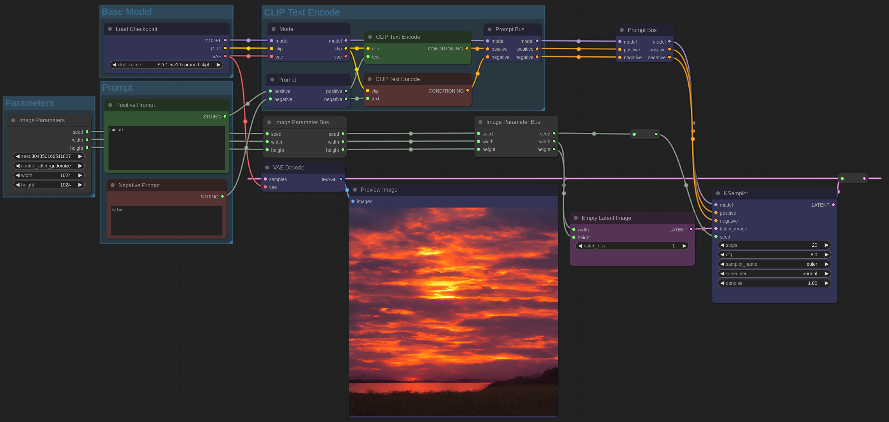

# comfyui-bus-plugin
> A collection of nodes for rerouting multiple I/O lines together in a bus.

> [!NOTE]
>
> Because ComfyUI does not support generic I/O connections there have to be different
> nodes for the different combinations of data being passed around.

## Nodes
These bus nodes are used to pass around specific groups of values from various sources:

| Name                        | Description                                                                       |
|-----------------------------|-----------------------------------------------------------------------------------|
| Checkpoint Bus              | Model, CLIP, and VAE from a loaded checkpoint.                                    |
| CLIP Encoded Prompt Bus     | CLIP Text Encoded positive and negative prompt and associated model.              |
| Image Bus                   | An image and mask from a loaded image, with optional VAE for VAE encoding.        |
| Image Parameter Bus         | Image width, height, and seed.                                                    |
| Image Size Bus              | Image width and height for the size of the image, target size, etc.               |
| Latent Image Bus            | A latent and VAE that can be passed to a VAE Decode node.                         |
| Latent Image Parameters Bus | A latent, seed, and denoise for an image2image KSampler source.                   |
| Prompt Bus                  | Positive and negative prompt text strings.                                        |
| Prompt SDXL Bus             | Positive and negative prompt text strings in the SDXL text_l and text_g variants. |

> [!NOTE]
>
> Some of these bus nodes &ndash; such as the Image Parameter Bus node &ndash; can have the
> inputs converted to widgets and be used as the input node to the bus or other workflows
> instead of creating primitive nodes for each parameter.

## License
Copyright (C) 2024 Reece H. Dunn

SPDX-License-Identifier: [GPL-3](LICENSE)
